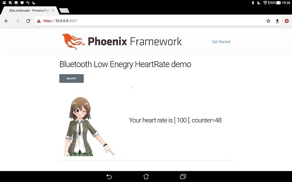

# BleLiveSample

[Demonstration(my Twitter)](https://twitter.com/ken_hamada/status/1114535963349225472)

This is a sample of Phoenix LiveView. This webserver gets Bluetooth Low Energy's hert rate sensor data, and view its results.

## Key technologies

* [WebBluetooth](https://www.w3.org/community/web-bluetooth/)
* [Phoenix](https://phoenixframework.org/)
* [LiveView](https://github.com/phoenixframework/phoenix_live_view)

## My environment

### System

 * Server : Ubuntu20.04 LTYS
 * Client : Chrome(MacOS and Android8.x tablet)
 * Device : [iOS LightBlue](https://itunes.apple.com/jp/app/lightblue-explorer/id557428110?mt=8)
    * LightBlue is BLE(Bluetooth Low Enegry) tool of iOS.

### Software (server side) 

 * Node_js v12.18.2
 * Erlang 11.0.2
 * Elixir 1.10.4
 * Phoenix 1.5.3

## How to build Phoenix server

To start your Phoenix server:

  * Install dependencies with `mix deps.get`
  * Install Node.js dependencies with `cd assets && npm install`
  * Creates a self-signed certificate etc `mix phx.gen.cert`
  * Start Phoenix endpoint with `mix phx.server` or  `iex -S mix phx.server`

Now you can visit [`localhost:4001`](https://localhost:4001) from your browser.

  * __In this example, this phx server use a self-signed certificate.__

Ready to run in production? Please [check deployment guides](https://hexdocs.pm/phoenix/deployment.html).

## How to use thie server

 * Start this server
 * Get [LightBlue](https://itunes.apple.com/jp/app/lightblue-explorer/id557428110?mt=8) to your iOS device.
 * Tap LightBlue 
 * Tap 'Create Virtual Peripheral'
 * Tap 'Heart Rate' in list
 * Tap 'Save'
 * Confirm check mark of 'Hert Rate' .
 * Then display LightBlue application. don't use screen lock while this test 
 * You visit https//xxx.xxx.xxx.xxx:4001 (xxx is server's IP) __with using Chrome(*1)__
 * Then you can check like this gif
      * https://twitter.com/ken_hamada/status/1114535963349225472

(*1) suppoted chorme is .. https://www.chromestatus.com/feature/5264933985976320

## More key technologies informations

About Phoenix

  * Official website: http://www.phoenixframework.org/
  * Guides: https://hexdocs.pm/phoenix/overview.html
  * Docs: https://hexdocs.pm/phoenix
  * Mailing list: http://groups.google.com/group/phoenix-talk
  * Source: https://github.com/phoenixframework/phoenix

About LiveView

  * GitHub: https://github.com/phoenixframework/phoenix_live_view

About WebBluetooth

  * Site: https://webbluetoothcg.github.io/web-bluetooth/
  * GitHub: https://github.com/WebBluetoothCG/web-bluetooth
  * GitHub(demo): https://github.com/WebBluetoothCG/demos

## Licences

ble_live_sample\assets\js\heartRateSensor.js is from

  * https://github.com/WebBluetoothCG/demos (Apache License 2.0)

ble_live_sample\assets\static\images\puronama image files are called Puronama-chan. Puronama-chan is licenced character by by Pronama LLC.

You can use these image files FREEWARE ONLY.
* https://kei.pronama.jp/guideline/ (Japanese)

## P.S.

* I'm beginner of web system, then these code maybe strange  :-)
* You can try this free software, but you will need to take full responsibility for your action.

